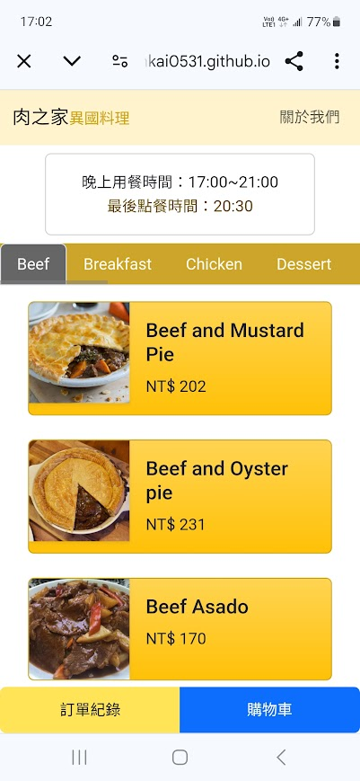
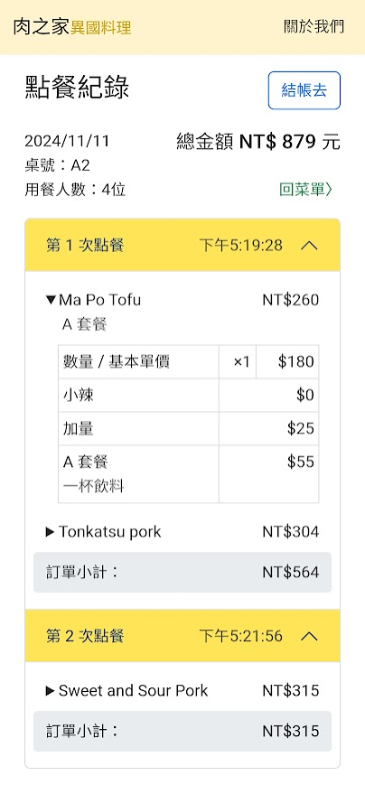

# 肉之家異國料理：模擬餐廳店內點餐網站

這是一個**模擬餐廳店內點餐網站**專案，餐廳名稱為「肉之家異國料理」。

**網站連結**：[https://jhihkai0531.github.io/mock_restaurant-ordering-website/](https://jhihkai0531.github.io/mock_restaurant-ordering-website/)

### 網站畫面擷取

### 功能介紹
顧客進入網站後，可以瀏覽完整菜單。

點擊餐點卡片進行客製化的餐點設定（如套餐選擇、辣度、加量、數量等），並將餐點加入購物車。

在購物車檢視餐點品項皆無誤後，送出訂單。

接著跳轉到點餐紀錄頁面，顧客可以查看已送出的訂單紀錄以及總共的金額。

最後可以按下結帳按鈕選擇現場或是線上付款，若選擇線上付款，會出現模擬的付款處理畫面，隨機回傳結果。

### 專案靈感
專案的靈感來自於有次在義式餐廳用餐時，看到餐廳使用 QR Code 掃碼點餐，

想到最近剛接觸 Vue.js 與 Bootstrap 5，正在尋覓專案主題，希望能夠將學到的基礎知識應用到實際作品當中。

而小餐廳的點餐網站正好具有基本的網站規格，又不至於過於龐大，同時也是近年許多餐廳業者逐漸採用的點餐方式，

因此便想嘗試復刻看看基本的結構。

或許日後真的需要製作這樣的案子時，可以從現在累積的經驗來延伸。

### 使用技術
- 本專案使用 Vue CLI 來建構，並結合 Vue Router 進行前端的路由切換。
- 在 Vue 的撰寫方式上使用 Options API。
- 主要使用 Bootstrap 5 來搭建樣式，搭配部分自訂的 CSS。

## 資源來源

本專案所使用的圖片及網站資源如下：

- **食物資料來源**：本專案使用的食物資料來自於免費食譜 API 網站 [TheMealDB](https://www.themealdb.com)。該網站主要提供各種食物的食譜，而本專案雖然不是食譜網站，但可以借用該 API 當中的一些圖片、食物名稱、食物種類等資料，來製作成模擬的餐點資訊。
- **網站圖示**：[Flaticon - Meal Icon](https://www.flaticon.com/free-icon/meal_3274099?term=meals&page=1&position=11&origin=search&related_id=3274099)

### 其他圖片來源
- **櫃檯圖片**：[Flaticon - Counter Icon](https://www.flaticon.com/free-icon/counter_3492385?term=counter&related_id=3492385)
- **信用圖片**：[Flaticon - Credit Icon](https://www.flaticon.com/free-icon/credit_1198299)
- **信用卡圖片**：[Flaticon - Credit Card Icon](https://www.flaticon.com/free-icon/credit-card_4117864?term=digital+payment&related_id=4117864)
- **錯誤頁面圖片**：[Flaticon - Error 404 Icon](https://www.flaticon.com/free-icon/error-404_3855833?term=error+404&page=1&position=4&origin=search&related_id=3855833)
