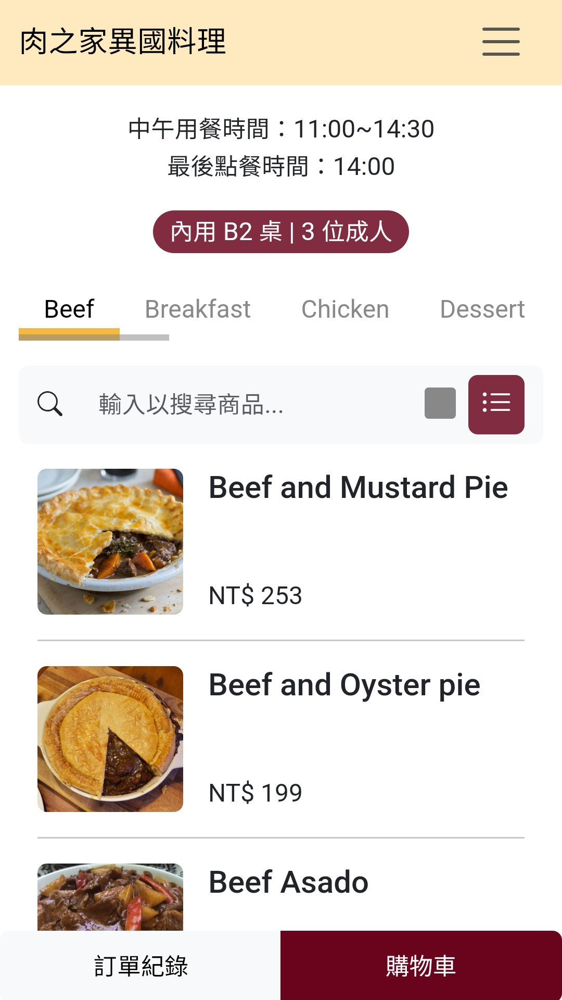
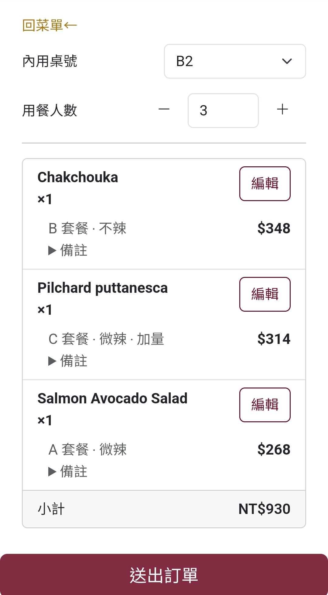

# 肉之家異國料理：模擬餐廳店內點餐網站

**肉之家異國料理**是一個專為熱愛肉類美食的顧客設計的模擬店內點餐網站。  
用戶可以輕鬆瀏覽豐富的菜單、客製化餐點、並快速完成訂單，享受現代化的用餐體驗。

🔗 **網站連結**：[https://jhihkai0531.github.io/mock_restaurant-ordering-website/](https://jhihkai0531.github.io/mock_restaurant-ordering-website/)

## Installation

1. Install dependencies:

   ```bash
   npm install
   ```

2. For local development:

   ```bash
   npm run dev
   ```

3. Preview a production build:

   ```bash
   npm run build
   npm run preview
   ```

## 網站畫面擷取

| **菜單頁面** | **購物車頁面** |
|--------------|----------------|
|  |  |

## 功能介紹

1. **菜單瀏覽與篩選**
   - 瀏覽完整菜單，輸入文字篩選商品名稱。
   - 自由切換菜單版面，滿足不同瀏覽需求。

2. **客製化與購物車**
   - 支援餐點客製化設定（套餐、辣度、數量等）。
   - 將餐點加入購物車，檢視購物車內容，隨時調整。

3. **訂單與付款**
   - 查看訂單明細、總金額，並模擬付款畫面。
   - 提供現場付款或線上付款選項。

## 專案靈感
專案的靈感來自於在外面餐廳用餐時，經常看到餐廳使用 QR Code 掃碼點餐，  
發現每家的設計與功能參差不齊，自己比較了欣賞的與有改進空間的網站覺得很有趣，也想測試自己的實作能力，  
便希望透過這個專案模擬打造一個直覺好用的點餐網站，並在實作中加深對 Vue.js 和前端工具的理解。

## 工具選擇
- **Vue.js**：元件化開發，提升程式結構的可讀性與維護性。
- **Vite**：用於開發、打包與部署。
- **Vue Router**：實現單頁應用程式（SPA）的路由切換。
- **Bootstrap**：快速搭建樣式與 UI 元件。

## 後續方向
目前這個模擬網站集中在前端互動功能的開發，因此尚未實現長期的資料儲存手段與後台管理。  
並且網站屬於架空的情境，因此部分內容如價格、餐點表單選項是假想而來。  
不過如果後續要將此網站架構套用到實際的餐廳網站，便會依據業主所提供之菜單、用餐流程、付款流程、網站文案等進行更進一步的客製化。

## 資源來源

本專案所使用的圖片及網站資源如下：

- **食物資料來源**：本專案使用的食物資料來自於免費食譜 API 網站 [TheMealDB](https://www.themealdb.com)。該網站主要提供各種食物的食譜，而本專案雖然不是食譜網站，但可以借用該 API 當中的一些圖片、食物名稱、食物種類等資料，來製作成模擬的餐點資訊。

- **圖示與圖片**：
  - [Flaticon - Icon 資源](https://www.flaticon.com)
  - [Unsplash - 圖片資源](https://unsplash.com)
